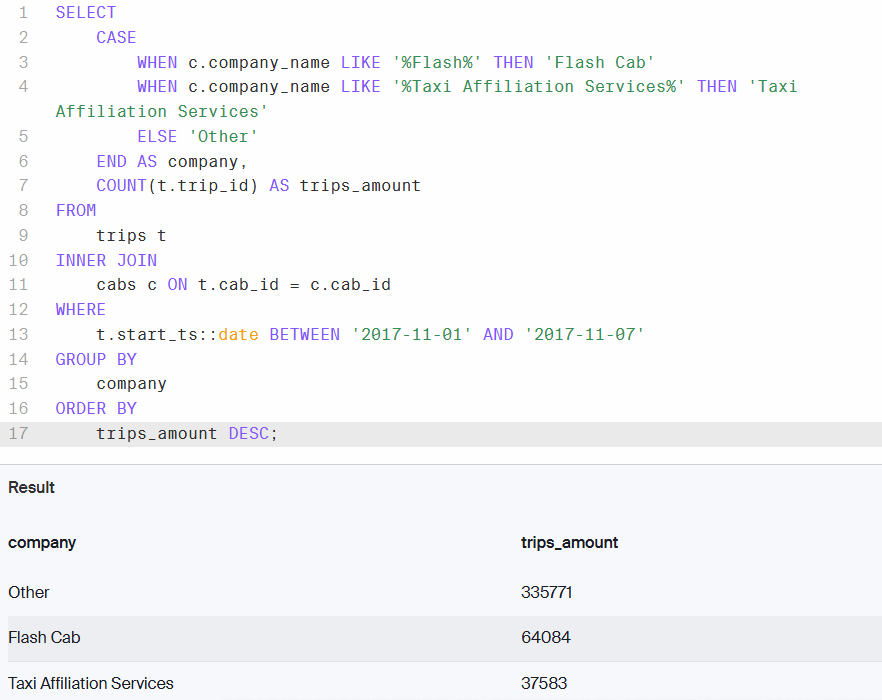
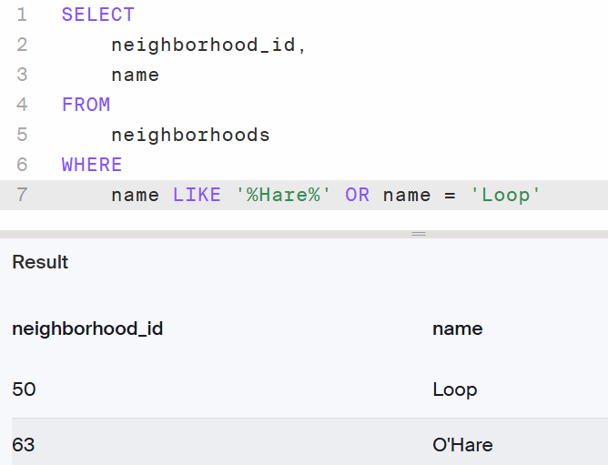

# Zuber SQL Analysis Report

## Project Description

Zuber, a new ride-sharing company preparing to launch in Chicago, seeks insights into passenger behavior and external factors affecting ride activity. This project analyzes historical taxi ride data to uncover trends, assess competitor performance, and determine how weather conditions influence demand. The dataset includes ride details, taxi company ownership, pickup and drop-off locations by neighborhood, and weather data.

## Analysis

The analysis focuses on the following core areas:

1. **Ride Volume by Taxi Company**  
   Rides from November 1–7, 2017, were analyzed to identify top-performing taxi companies. Flash Cab and Taxi Affiliation Services emerged as the leading competitors, while all other companies were grouped under "Other." The number of rides per company was calculated and sorted in descending order to determine market dominance during this period.

    

3. **Neighborhood Identification**  
   Using the `neighborhoods` table, neighborhood IDs were retrieved for two key areas in Chicago: O'Hare and the Loop. These identifiers support further geo-based ride trend analysis.

    

## Conclusions

- **Dominant Taxi Companies:** Flash Cab and Taxi Affiliation Services had the highest number of rides between November 1–7, 2017, suggesting a strong market presence during the sample period.
- **Location Reference Established:** Successfully identifying the neighborhood IDs for O'Hare and the Loop provides a foundation for geographic ride analysis, especially in terms of airport traffic and downtown activity.

## Recommendations

- **Target Competitor Strategies:** Zuber should study the operational strategies of Flash Cab and Taxi Affiliation Services to understand what drives their high ride volume—considering pricing, availability, and geographic focus.
- **Focus Launch Zones:** Zuber may benefit from emphasizing service coverage in the Loop and O'Hare neighborhoods where ride demand is likely high.
- **Weather-Based Ride Modeling:** Integrate weather data further to build predictive models for ride demand. This would allow Zuber to adjust driver availability based on weather forecasts.
